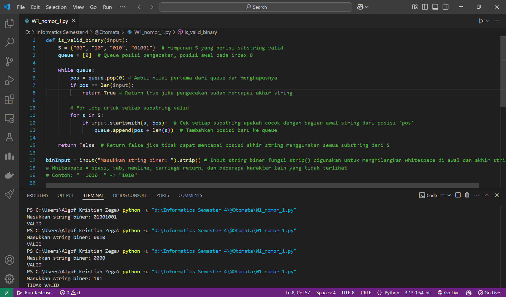
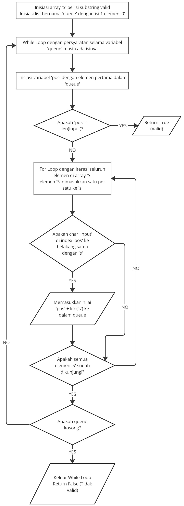

# Tugas W1 Otomata
| Name           | NRP        | Kelas     |
| ---            | ---        | ----------|
| Algof Kristian Zega | 5025231235 | Otomata (E) |
| Gregorius Setiadharma | 5025231268 | Otomata (E) |
| Muhammad Davin Aulia Rizky | 5025231275 | Otomata (E) |
| Muhammad Aditya Handrian | 5025231292 | Otomata (E) |

## 1. Binary Checker

> Implement Binary Checker. Write explanation, how to use, example input and output

**Answer:**

- Screenshot



- Source code

    ```py
    def is_valid_binary(input):
        S = {"00", "10", "010", "01001"}  # Himpunan S yang berisi substring valid
        queue = [0]  # Queue posisi pengecekan, posisi awal pada index 0
        
        while queue:
            pos = queue.pop(0)
            if pos == len(input):
                return True # Return true jika pengecekan sudah mencapai akhir string
            
            # For loop untuk setiap substring valid
            for s in S:
                if input.startswith(s, pos):  # Cek setiap substring apakah cocok dengan bagian awal string dari posisi 'pos'
                    queue.append(pos + len(s))  # Tambahkan posisi baru ke queue
        
        return False  # Return false jika tidak dapat mencapai posisi akhir string menggunakan semua substring dari S

    binInput = input("Masukkan string biner: ").strip()

    if is_valid_binary(binInput):
        print("VALID")
    else:
        print("TIDAK VALID")
    ```

- Explanation

    Terdapat function "is_valid_binary" yang menerima parameter "input". <br>
    Menginisiasi variabel "binInput" dengan inputan biner dari user dan menjalankan method "strip()" untuk menghapus whitespace di awal dan akhir string <br>
    Lalu menjalankan function "is_valid_binary" dengan mengirim parameter "binInput" dan jika mengembalikan nilai `True` berarti valid jika mengembalikan nilai `False` berarti tidak valid. <br>
    `Miro Link` : <br>
    [Link Miro for Function "is_valid_binary" Flow Diagram](https://miro.com/app/board/uXjVIXEwcaY=/?share_link_id=138214322819)
    ### Function "is_valid_binary" Flow Diagram

