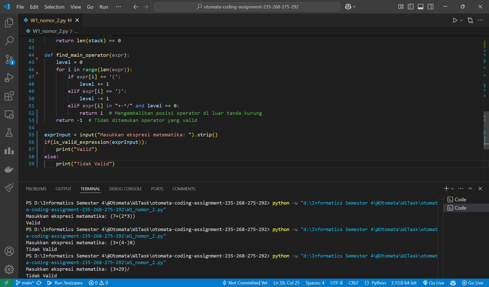
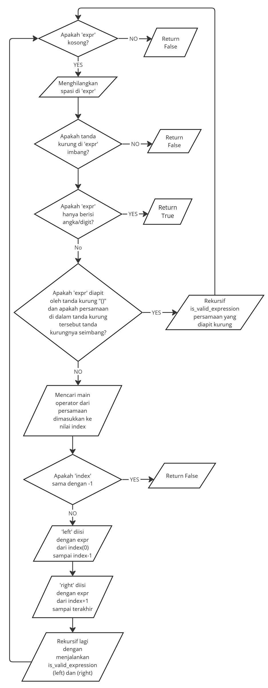

# Tugas W1 Otomata
| Name           | NRP        | Kelas     |
| ---            | ---        | ----------|
| Algof Kristian Zega | 5025231235 | Otomata (E) |
| Gregorius Setiadharma | 5025231268 | Otomata (E) |
| Muhammad Davin Aulia Risky | 5025231275 | Otomata (E) |
| Muhammad Aditya Handrian | 5025231292 | Otomata (E) |

## 1. Binary Checker

> Implement Binary Checker. Write explanation, how to use, example input and output

**Answer:**

- Screenshot


- Source code

    ```py
    def is_valid_binary(input):
        S = {"00", "10", "010", "01001"}  # Himpunan S yang berisi substring valid
        queue = [0]  # Queue posisi pengecekan, posisi awal pada index 0
        
        while queue:
            pos = queue.pop(0)
            if pos == len(input):
                return True # Return true jika pengecekan sudah mencapai akhir string
            
            # For loop untuk setiap substring valid
            for s in S:
                if input.startswith(s, pos):  # Cek setiap substring apakah cocok dengan bagian awal string dari posisi 'pos'
                    queue.append(pos + len(s))  # Tambahkan posisi baru ke queue
        
        return False  # Return false jika tidak dapat mencapai posisi akhir string menggunakan semua substring dari S

    binInput = input("Masukkan string biner: ").strip()

    if is_valid_binary(binInput):
        print("VALID")
    else:
        print("TIDAK VALID")
    ```

- Explanation

    Terdapat function "is_valid_binary" yang menerima parameter "input". <br>
    Menginisiasi variabel "binInput" dengan inputan biner dari user dan menjalankan method "strip()" untuk menghapus whitespace di awal dan akhir string <br>
    Lalu menjalankan function "is_valid_binary" dengan mengirim parameter "binInput" dan jika mengembalikan nilai `True` berarti valid jika mengembalikan nilai `False` berarti tidak valid. <br>
    `Miro Link` : <br>
    [Link Miro for Function "is_valid_binary" Flow Diagram](https://miro.com/app/board/uXjVIXEwcaY=/?share_link_id=138214322819)
    ### Function "is_valid_binary" Flow Diagram


## 2. Arithmetic Expression Checker

> Implement Arithmetic Expression Checker. Write explanation, how to use, example input and output

- Screenshot :



- Source Code :

    ```py
    import re

    def is_valid_expression(expr):

        if len(expr) == 0: # Jika ekspresi kosong, return False
            return False

        expr = expr.replace(" ", "")  # Menghilangkan spasi untuk memudahkan pengecekan

        # Mengecek apakah tanda kurung sudah seimbang
        if not is_balanced(expr): # Jika tanda kurung tidak seimbang, return False
            return False

        # Base case: jika expr hanya angka, return True
        if re.fullmatch(r"\d+", expr): # Jika hanya angka, return True
            return True

        # Jika persamaan diapit oleh tanda kurung dan persamaan di dalamnya balanced, cek apakah persamaan di dalamnya valid
        if expr[0] == '(' and expr[-1] == ')' and is_balanced(expr[1:-1]):
            return is_valid_expression(expr[1:-1])

        # Mencari operator utama dalam persamaan
        index = find_main_operator(expr)
        if index == -1:
            return False

        left = expr[:index] # Bagian kiri dari operator utama
        right = expr[index+1:] # Bagian kanan dari operator utama

        # Rekursif cek apakah kedua bagian valid (kiri dan kanan dari operator utama)
        return is_valid_expression(left) and is_valid_expression(right)

    def is_balanced(expr): # Mengecek apakah tanda kurung sudah seimbang
        stack = []
        for char in expr:
            if char == '(':
                stack.append(char)
            elif char == ')':
                if not stack: # Jika stack kosong return False
                    return False
                stack.pop()
        return len(stack) == 0 # Return apakah stack sudah kosong, jika kosong True, jika tidak False

    def find_main_operator(expr):
        level = 0
        for i in range(len(expr)):
            if expr[i] == '(':
                level += 1
            elif expr[i] == ')':
                level -= 1
            elif expr[i] in "+-*/" and level == 0:
                return i  # Mengembalikan posisi operator di luar tanda kurung
        return -1  # Tidak ditemukan operator yang valid

    exprInput = input("Masukkan ekspresi matematika: ").strip()
    if(is_valid_expression(exprInput)):
        print("Valid")
    else:
        print("Tidak Valid")
    ```

- Explanation :

    Terdapat function "is_valid_expression" yang menerima parameter "expr". <br>
    Terdapat function "is_balanced" yang menerima parameter "expr". <br>
    Terdapat function "find_main_operator" yang menerima parameter "expr". <br>
    Menginisiasi variabel "exprInput" dengan inputan biner dari user dan menjalankan method "strip()" untuk menghapus whitespace di awal dan akhir string <br>
    Lalu menjalankan function "is_valid_expression" dengan mengirim parameter "exprInput" dan jika mengembalikan nilai `True` berarti valid jika mengembalikan nilai `False` berarti tidak valid. <br>

    `Miro Link` : <br>
    [Link Miro for Function "is_valid_expression" Flow Diagram](https://miro.com/app/board/uXjVIXEwcaY=/?share_link_id=138214322819)
    ### Function "is_valid_expression" Flow Diagram
    
    